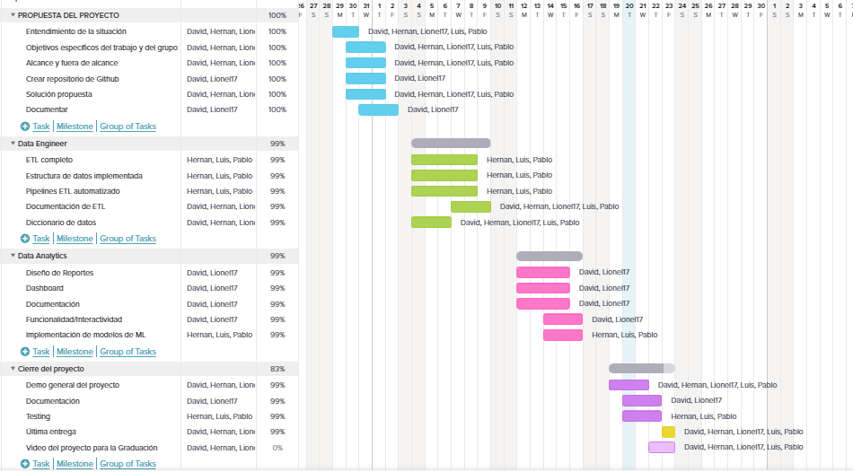

    

<h1 align="center">Analisis de factores influyentes en la esperanza de vida al nacer</h1>

    

Somos una consultora especializada en análisis  y toma de decisiones basada en datos. Nuestro equipo está conformado por profesionales altamente capacitados y con amplia experiencia en proyectos de consultoría de datos, lo que nos permite abordar de manera integral proyectos de diversa complejidad y magnitud.

Nuestra misión es ayudar a nuestros clientes a obtener información valiosa a partir de sus datos para mejorar su toma de decisiones y optimizar sus procesos. Nos destacamos por brindar soluciones personalizadas, adaptadas a las necesidades y objetivos específicos de cada cliente. Trabajamos de manera colaborativa, estableciendo una estrecha relación con nuestros clientes para comprender a fondo su problemática y ofrecerles las mejores soluciones.

---
## Entendimiento de la situación actual:
La empresa farmacéutica Pfizer ha delineado su objetivo de desarrollar un nuevo medicamento. Para dar inicio a la planificación de este proyecto, la empresa requiere recopilar datos relevantes que influyan en la esperanza de vida, tasas de fecundidad promedio y otros factores demográficos clave. Esta información será fundamental para determinar la ubicación demográfica más adecuada en la cual invertir y llevar a cabo el desarrollo del medicamento.

  

Para lograr este objetivo, Pfizer ha contratado a nuestra consultora, con el fin de realizar un estudio sobre la esperanza de vida y otros indicadores relevantes para comprender los factores que influyen en la vitalidad de las personas.
Con el modelo de ML trataremos de resolver estos interrogantes
¿Qué hace que un país tenga mayor esperanza de vida?
¿Cuáles son las características predominantes para que un país tenga mayor esperanza de vida?

Para la realización de este proyecto utilizamos principalmente las siguientes fuentes.

Banco mundial: https://data.worldbank.org/

Organización mundial de la salud: https://www.who.int/

  
  

---
## Objetivos:
1. Analizar las tendencias actuales de la esperanza de vida en diferentes países y regiones.
2. Identificar los factores determinantes de la esperanza de vida, como las tasas de mortalidad infantil, la calidad de los servicios de atención médica, el acceso a servicios básicos de salud y otros indicadores relevantes.
3. Proporcionar recomendaciones para el desarrollo del nuevo medicamento que promueve la fertilidad y la vitalidad en hombres y mujeres.

---

## Alcance:
Recopilar y analizar datos demográficos, como la esperanza de vida al nacer, esperanza de vida saludable, el índice de envejecimiento y otros, de diferentes fuentes confiables.
El estudio se centrará en países de América del Sur, América del Norte, Centroamérica y Oceanía, utilizando datos recopilados durante los últimos 30 años.
Como posibilidad de continuidad del proyecto, se plantea la expansión a otros países de los otros continentes o la inclusión de factores adicionales.

---
## KPIs:  
Los indicadores clave de rendimiento o, más comúnmente conocidos KPIs, son indicadores clave de rendimiento que se utilizan para evaluar el éxito de las acciones y/o procesos en la medida en que estos contribuyen a la obtención de los objetivos, para determinar en función de estos si las acciones dan los frutos esperados o si en cambio es necesario realizar correcciones.
La metodología de determinación de KPI sigue el concepto de los reconocidos objetivos SMART.  El acrónimo S (specific) específico, M (Mesurable) medible, A (Attainable) alcanzable, R (Relevant) relevante, T (Time-bound) con limite de tiempo.

---

`Esperanza de vida al nacer(años):` - Objetivo incremento del 1% del año 2019 respecto delaño 2020. Es el indicador principal que mide la esperanza de vida promedio de una población al nacer. Es un KPI fundamental para evaluar la salud y el bienestar general de una población.  

Para el caso de esperanza de vida saludable, se obtuvieron datos de manera completa y concisa, de los países del continente americano. Si bien, no notamos cambios significativos en el tiempo, cabe remarcar que países como Canadá, representa una esperanza de vida saludable  de 69 años. Esto lo posiciona como el país con mejor esperanza de vida saludable. 

`Esperanza de vida saludable(años):` - Objetivo aumento 1% del año 2019 respecto del año 2020. Es una medida que combina la esperanza de vida al nacer con la proporción de años vividos en buena salud. El índice de esperanza de vida saludable proporciona una visión más completa de la salud de una población al considerar tanto la duración como la calidad de vida.  
`Tasa mortalidad infantil` - Objetivo disminución 1% tasa de mortalidad infantil comparando dos últimos años con datos. Es la cantidad de niños que mueren antes de cumplir un año de edad por cada 1,000 nacidos vivos. Es un KPI crítico para evaluar la calidad de los servicios de atención médica materno-infantil y la salud general de la población.

---
## Stack tecnológico:
`Herramientas de trabajo:` Visual Studio Code, Jupyter Lab, Google Colab y Microsoft Azure.  

    
    
    
    

    

`Lenguaje de programación:` Python.  

    

`Bibliotecas:` Pandas, NumPy, Scikit-learn, Matplotlib, Seaborn, y Pyspark.  

    
    
    
    
    

`Herramientas de visualización:` Power BI, Streamlit 

    
    

  

`Repositorio de código:` GitHub    

    

---
## Diseño detallado 
`Análisis exploratorio de datos:` Documento que detalla el proceso de limpieza y exploración de los datos.    
`Modelos estadísticos y de aprendizaje automático:` Informe que describe los modelos desarrollados y los resultados obtenidos.    
`Dashboard interactivo:` Presentación visual de los resultados del análisis, incluyendo gráficos y visualizaciones interactivas.    
`Informe final y recomendaciones:` Documento que resume los hallazgos del análisis y proporciona recomendaciones basadas en los resultados.    

---
## Equipo de trabajo - Roles y responsabilidades:
`Data Engineer:` Encargado de diseñar e implementar los pipelines de ETL y configurar la infraestructura de datos.  
`Data Analyst:` Responsable del análisis exploratorio de datos, modelado estadístico y desarrollo de modelos predictivos.   
`Functional Analyst:` Asegurar de que el proyecto progrese de manera efectiva y se alcancen los objetivos establecidos al asumir diferentes roles.  
 
---

## Diseño adecuado del Modelo ER:

Después de enviar los datos a Azure SQL Database, es el momento de mejorar la estructura de la base de datos mediante la normalización. Para lograr esto, se han creado cuatro tablas dimensionales: "Country", "Region", "Indicadores" y "Category". Además, se han creado 15 tablas de datos, una por cada indicador, con los siguientes campos: "id_country", "id_region", "id_indicador", "id_category" y el valor del indicador.

Es importante destacar que se ha implementado una clave surrogada utilizando el código del país y los dos últimos dígitos del año correspondiente. Esta clave proporciona un identificador único para cada registro. Las tablas dimensionales y las tablas de datos están relacionadas mediante claves primarias y foráneas.

Gracias a este enfoque, se ha logrado una base de datos completamente normalizada y relacionada, lista para realizar análisis posteriormente mediante una conexión con Power BI.

---

## Etapas del proyecto 
Para la división y el cronograma de trabajo se utilizaron Trello y la metodolgía SCRUM del trabajo en nuestro equipo.  
link Trello:https://trello.com/b/hON6bmVO/pg-esperanza-de-vida  

Para obtener una idea global de la distribución y organización de tiempo y esfuerzo de trabajo de las diferentes tareas, se desarrolló un gráfico de gantt.  
link gantt: https://app.teamgantt.com/projects/gantt?ids=3553277  

    

El camino recorrido para la ejecucion de esta consultoria fueron la siguientes:  

### Análisis preliminar de calidad de datos:
Realizaremos un análisis detallado de los datos con los que vamos a trabajar. Analizaremos  la descripción de cada indicador, los tipos de datos, el método de adquisición y las fechas de adquisición y actualización.
Para la recopilación y el análisis de los datos, decidimos basarnos en la base de datos brindada por el Banco Mundial y la Organización Mundial de la Salud (WHO) dado que la confianza y transparencia de su información.

### Recopilacion y extracción de datos

`Variedad de fuentes de datos:`Al utilizar tanto la descarga de archivos CSV del Banco Mundial como la API de la OMS, se ha aprovechado la variedad de fuentes de datos disponibles. Esto permite obtener información diversa y enriquecedora de diferentes organismos y fuentes confiables, lo que a su vez mejora la calidad y la relevancia de los datos extraídos.

Te presentamos el proceso de obtención y extracción de datos, donde utilizamos tanto fuentes estáticas como dinámicas.

`Base de datos estática (.CSV):` Desde la página del Banco Mundial, realizamos una selección de los indicadores relevantes para nuestro análisis. Aplicamos filtros según los países, años y series de datos que nos interesan, para obtener una información más específica y precisa. Una vez configurados los parámetros de búsqueda, procedemos a descargar los datos en formato CSV.

`Base de datos dinámica (API):` Paso a detallar descarga descarga de la API Organización Mundial de la Salud(WHO):

Se pide respuesta a la url donde se encuentra el archivo con el indicador pedido, para la descarga. Será transformado el archivo mediante la biblioteca pyspark para su posterior uso. Esto se debe hacer indicador por indicador. 

`Limpieza de datos:` Limpiar datos para su posterior uso.  
---

## Pipelines para alimentar el Data Lake:

Desarrollaremos pipelines de extracción, transformación y carga (ETL) para alimentar el Data Lake. Estos pipelines automatizan el proceso de integración y limpieza de los datos, asegurando la calidad de los mismos. Esto proceso se hará de manera local.

Luego aplicaremos las transformaciones necesarias para adaptarlos a nuestros requisitos. Esto incluirá procesos como limpieza de datos, filtrado, agregación y normalización. Utilizamos la biblioteca pandas para llevar a cabo estas transformaciones de manera eficiente.

Posterior a las transformaciones, procederemos a cargar los datos en nuestro Data Lake utilizando las bibliotecas de Azure Storage Blobs Client. Aseguraremos una estructura adecuada de carpetas y archivos que se ajuste a nuestras necesidades y al esquema de datos definido para nuestro Data Lake.

---
## Data Warehouse:
Estableceremos conexión con Azure Storage Blob utilizando las bibliotecas de Azure Storage Blobs Client. Para subir nuestro Data Warehouse a la nube.

Implementaremos una estructura de Data Warehouse para almacenar los datos preparados y listos para su análisis. Para automatizar el proceso de carga y creación de una tablas  base de datos en Azure SQL DataBase, utilizaremos Azure Data Factory.

Azure Data Factory es una herramienta de orquestación de datos en la nube, para crear un flujo de trabajo que nos permita extraer los datos de Azure Storage Blob y cargarlos en una base de datos en Azure SQL DataBase.

Azure Data Factory nos brinda la capacidad de definir tareas de extracción, transformación y carga de datos (ETL) dentro de nuestro flujo de trabajo.

Una vez configurado el flujo de trabajo en Azure Data Factory, los datos se enviarán desde Azure Storage Blob a Azure SQL DataBase.

---
## Automatización:

La automatización de los procesos de ETL es una estrategia valiosa cuando se trata de manejar grandes volúmenes de datos que requieren actualizaciones frecuentes. Sin embargo, en el caso específico donde los datos se cargan con una frecuencia muy baja, no es necesario implementar una automatización completa por las siguientes razones:

`Frecuencia de carga:` Si los datos se cargan solo una vez al año o con una frecuencia muy baja, el esfuerzo y el tiempo necesario para desarrollar y mantener un sistema automatizado de ETL pueden superar los beneficios obtenidos. La automatización se vuelve más relevante cuando hay actualizaciones periódicas y regulares que justifican la inversión en tiempo y recursos para configurar y mantener los procesos automatizados.

`Complejidad de los procesos:` Los procesos de carga simples no involucran transformaciones complejas o una gran cantidad de datos, realizarlos localmente puede ser más eficiente y práctico.

`Costo y recursos:` La implementación de una automatización completa de los procesos de ETL implica invertir en herramientas, infraestructura y recursos humanos. Si los datos se cargan con baja frecuencia, destinar recursos significativos para desarrollar y mantener la automatización puede no ser justificado desde una perspectiva de costos.

---
## Producto final
---
### Modelos de aprendizaje automatico
---
### Modelo no supervisado:
El modelo KNN no se utiliza para la clasificación, regresión o clustering. En cambio, utiliza el modelo KNN para encontrar los indicadores más influyentes para la esperanza de vida en un conjunto de datos.

Dado que el modelo no involucra la predicción de etiquetas o la agrupación de datos no etiquetados, se puede considerar como un enfoque no supervisado, ya que no se utiliza información de clase o etiquetas para guiar el proceso de selección de indicadores. En cambio, se utiliza la proximidad de los datos en el espacio de características para determinar qué indicadores están más estrechamente relacionados con la esperanza de vida.

Se crea una instancia del modelo KNN (NearestNeighbors) con una métrica de distancia euclidiana. Este modelo se ajusta a la matriz de características imputadas.

En resumen, el modelo utiliza el modelo KNN para encontrar indicadores similares entre diferentes países y determinar qué indicadores son más relevantes para la esperanza de vida al nacer. Esto se logra mediante el cálculo de distancias entre países y la identificación de los indicadores que están más cercanos en términos de características.

link: https://perico3372-life-expectancy-streamlit-1r8po5.streamlit.app/

### Modelo supervisado:
El modelo realizo un análisis de series de tiempo y pronósticos de esperanza de vida al nacer utilizando el modelo ARIMA. 
ARIMA (AutoRegressive Integrated Moving Average) es un modelo estadístico utilizado para el análisis y pronóstico de series de tiempo. Combina componentes autoregresivos (AR), componentes de media móvil (MA) y diferenciación para modelar patrones y tendencias en los datos de series de tiempo.

    Componente autoregresivo (AR): Representa la relación entre una observación y un número específico de observaciones pasadas llamadas "retardos". Utiliza una regresión lineal de las observaciones pasadas para predecir la observación actual.

    Componente de media móvil (MA): Representa la relación entre una observación y un error residual de un modelo de media móvil aplicado a observaciones pasadas.

    Diferenciación: La diferenciación se utiliza para eliminar la tendencia de la serie de tiempo aplicando la diferencia entre observaciones consecutivas. Esto ayuda a estabilizar la media y eliminar la tendencia lineal.

El modelo ARIMA se utiliza comúnmente para predecir valores futuros en series de tiempo. Los parámetros del modelo ARIMA (p, d, q) indican el número de retardos autoregresivos, el orden de diferenciación y el número de retardos de la media móvil, respectivamente.

El proceso de ajuste de un modelo ARIMA implica encontrar los mejores valores de los parámetros (p, d, q) que minimizan una métrica de ajuste, como el criterio de información de Akaike (AIC) o el error cuadrático medio (MSE), utilizando técnicas de búsqueda en cuadrícula u otros métodos de optimización.

Una vez ajustado el modelo ARIMA, se pueden realizar pronósticos de los valores futuros de la serie de tiempo utilizando los parámetros estimados. Estos pronósticos pueden ser útiles para comprender las tendencias y patrones futuros en los datos de series de tiempo y respaldar la toma de decisiones.

link: https://lionelmc-pg-esperanza-vida-esperanza-vida-v2-1avwj4.streamlit.app/

Siguiendo con el análisis de datos de nuestro proyecto, al momento de visualizar y tomar las mejores decisiones y plasmar toda la información recopilada. 

---
### KPI
El estudio fue realizado en países del continente americano y el continente de oceánico.

---
#### ***Aumento del 1% en la ssperanza de vida(2.019 respecto del año 2.020):***
Optamos por este alcance ya que notamos un gran contraste entre países de centro-Latinoamérica e islas de Oceanía con respecto a Norteamérica y países como Australia.  
En el caso de Norteamérica (Canadá y Estados Unidos, el comportamiento de la esperanza de vida fue ascendiendo en los últimos 30 años de manera gradual, reconociendo que las mujeres que a nivel general las mujeres tienen una mayor esperanza de vida en promedio que los hombres debido a un sinfín de razones. Cabe remarcar que Canadá es quien lidera el ranking en este sentido, ya que la esperanza de vida a nivel general es de 80 años, siendo así  las mujeres con una mayor cantidad de años de esperanza de vida al nacer (84 años).  
En el caso de centro-américa pasa algo similar como en las pequeñas islas de Oceanía, destacándose Haití como el promedio más bajo, debido al terremoto en el año 2010 ocurrido en la capital haitiana de Puerto Príncipe, que dejó un saldo de más de 300.000 víctimas y 350.000 heridos según datos de la ONU. Esto impacta notablemente dentro de nuestro indicador a analizar.  
Otro valor atípico que encontramos dentro de nuestro análisis y que creemos que es importante  fue en el 1998, en el país de Honduras, donde obtuvimos un pico de 5.1 puntos, esto se produjo debido al Huracán de Mitch producido en dicho país, que se cargó de aproximadamente 19.000 víctimas, dejando daños devastadores en la sociedad.
En el caso de Sudamérica y demás países, no encontramos variaciones significativas en el tiempo, cabe remarcar que no tienen mismo nivel de esperanza de vida al nacer de países como Canadá o Australia, pero en los últimos años se está viendo un crecimiento de manera gradual.  
El objetivo de estudiar el comportamiento de este indicador a través de los años, es lograr un crecimiento significativo a para los próximos años

---
#### ***Aumento del 1% en la Esperanza de vida saludable(2.019 respecto del año 2.020):***
Para el caso de esperanza de vida saludable, se obtuvieron datos de manera completa y concisa, de los países del continente americano. Si bien, no notamos cambios significativos en el tiempo, cabe remarcar que países como Canadá, representa una esperanza de vida saludable  de 69 años. Esto lo posiciona como el país con mejor esperanza de vida saludable. 
En lado opuesto encontramos a Haití, llevándose el último puesto en el ranking de esperanza de vida saludable. Como objetivo, plantemos incrementar la cantidad de años de esperanza de vida saludable en un 1% en relación al último año.
Objetivo esperanza de vida saludable 

---
#### ***Disminución de la tasa de mortalidad infantil(2.019 respecto del año 2.020):***
El tercer objetivo a analizar en cuestión fue la tasa de mortalidad infantil, observando y analizando su evolución en los últimos 30 años. Para este análisis se opto por mencionar a los  países con mayor y menor tasa y ver su evolución a través del tiempo.  
En el caso de Oceanía, notamos un gran contraste entre países como Papua Nueva Guinea y Australia, siendo ésta primero una media de 50,50 con respecto a la segunda 4,80.
Si bien en los últimos años se registra una disminución de este valor, no deja de sorprender la diferencia entre ambos países en estudio.  
Siguiendo con el estudio en cuestión, en el caso de Sudamérica, quien lidera este análisis es Bolivia. Se estima que las enfermedades como la Neumonía, enfermedades Diarreica, y distintas dificultades al nacer son las principales causas en este dato, así como los factores socio-económicos y culturales.  
En el caso de Centroamérica, quien lidera este top es Haití, con una media de 68,20 por cada mil niños, se convierte en el país con mayor tasa de mortalidad infantil, debido a lo mencionado en los primeros párrafos.  
Para terminar, no podemos dejar afuera a dos potencias como Canadá y Estados Unidos, siendo los dos países con menor tasa de mortalidad infantil (5,30 Canadá ;6,80 Estado Unidos de America)  ,dato muy importante por si piensas tener hijos.

#### ***Aumento del 1% en la tasa de fecundidad(2.019 respecto del año 2.020):***
Para terminar, se decidió analizar aquellos países con menor tasa de fecundación en los últimos años, notamos que en América del sur no hubo grandes diferencia en relación de un país a otro.  
En el caso de Centro y Norte América, cabe destacar países como Cuba y Canadá, si bien las circunstancias son incontables, notamos un gran contraste en relación a la calidad de vida en uno y otro. Cabe remarcar que la tasa en Cuba es de 11,80 por cada mil mujeres, y en Canadá de 11,00 (por cada mil mujeres) en el primer caso se debe a los factores socio-económicos a la constante migración.   
Por último, en el caso de Oceanía, quien lidera este ranking como menor tasa de fecundidad es Australia, un país altamente desarrollado y con una alta calidad de esperanza de vida
Este estudio se realizo con el objetivo de incrementar la tasa de fecundidad en aquellos países que tienen una muy baja tasa de fecundidad.  

`Dashboard de visualización:` Crear un dashboard interactivo que presente los resultados del análisis y permita explorar los datos.    

`Informe y recomendaciones:` Documentar los hallazgos del análisis y proporcionar recomendaciones basadas en los resultados.  

---
### Contenido del repositorio

-EDA(Exploratory data analysis)  
-ETL(Extract, Transform, Load)  
-Modelo de aprensizaje automatico(Streamlit)   
-Archivo final en formato csv (DATA_PF_IV.csv)  
-Diagrama de Gantt.  
-Metodología SCRAUM(Herramienta Trello)  
-Dashboard interactivo(PowerBI)  
-Documentacion entregable de a semana del pryecto.  
-Documentación final(Resumen de la documentación del entregable)  
-README.md  

☄️ Licencia ☄️
El uso de este trabajo está licenciado bajo GNU General Public License v3.0 (GNU GPLv3).
